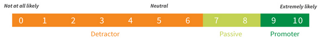

<div align='justify'>

# **Net Promoter Score**

![BADGE_NODE_VERSION]
![BADGE_NPM_VERSION]
![BADGE_LICENSE]
![BADGE_ISSUES_OPEN]
![BADGE_ISSUES_CLOSED]
![BADGE_OPEN_PULL_REQUESTS]
![BADGE_STARS]
![BADGE_FORKS]

> An simple Net Promoter Score.

---

### **INDEX**

- 📄 **[About](#about)**
- 📝 **[Requirements](-requirements)**
- 📦 **[Releases](#-releases)**
- 💻 **[Techs](#-techs)**
- ⚒️ **[Tools](#%EF%B8%8F-tools)**
- ⚙️ **[Settings](#%EF%B8%8F-settings)**
- 🍷 **[Using](#-using)**
- 🌱 **[Contributing](#-contributing)**
- 💡 **[Author](#-author)**
- 🧾 **[License](#-license)**

---

<br>

## 📄 **About**

Net Promoter Score®, or NPS®, measures customer experience and predicts business growth. This proven metric transformed the business world and now provides the core measurement for customer experience management programs the world round.



This repository aims to perform an NPS calculation and send the experiment by email.

<kbd>[⬆️ Index](#index)</kbd>

<br>

## 📝 **Requirements**

Read the requirements of this project **[here](./docs/requirements)**.

<kbd>[⬆️ Index](#index)</kbd>

<br>

## 📦 **Releases**

See **[CHANGELOG](./docs/guides/CHANGELOG.md)** file for read about the releases.

<kbd>[⬆️ Index](#index)</kbd>

<br>

## 💻 **Techs**

- [NodeJS](https://nodejs.org/en/)
- [TypeScript](https://www.typescriptlang.org/)
- [Jest](https://jestjs.io/)
- [Supertest](https://github.com/visionmedia/supertest)
- [Commitlint](https://github.com/conventional-changelog/commitlint)
- [Husky](https://github.com/typicode/husky)
- [Lint Staged](https://github.com/okonet/lint-staged)
- [ESLint](https://eslint.org/)
- [Prettier](https://prettier.io/)
- [TS Node Dev](https://www.npmjs.com/package/ts-node-dev)
- [Express.js](https://expressjs.com/)
- [TypeORM](https://typeorm.io/#/)
- [UUID](https://www.npmjs.com/package/uuid)
- [SQLite3](https://www.npmjs.com/package/sqlite3)
- [Reflect Metadata](https://www.npmjs.com/package/reflect-metadata)
- [NodeMailer](https://nodemailer.com/about/)
- [Ethereal](https://ethereal.email/)
- [Handlebars](https://handlebarsjs.com/)
- [DotENV](https://github.com/motdotla/dotenv)

<kbd>[⬆️ Index](#index)</kbd>

<br>

## ⚒️ **Tools**

- [Insomnia](https://insomnia.rest/)
- [Beekeeper Studio](https://www.beekeeperstudio.io/)

<kbd>[⬆️ Index](#index)</kbd>

<br>

## ⚙️ **Settings**

- Install the [NodeJS](https://nodejs.org/en/download/) in the version 14.x.
- After NodeJS installation, run:

```bash
$ npm ci && npm install
```
- Now, copy `.env.example` file to `.env`:

```bash
$ cp .env.example .env
```

<kbd>[⬆️ Index](#index)</kbd>

<br>

## 🍷 **Using**

### Starting Server in Dev Mode

```bash
$ npm run dev
```

### Starting Server in Production Mode

```bash
$ npm start
```

### Creating a Migration

```bash
$ npx typeorm migration:create -n MigrationName
```

### Running a Migrations

```bash
$ npx typeorm migration:run
```

### Build

```bash
$ npm run build
```

### Running Unit Tests

```bash
$ npm run test:unit
```

### Running Integration Tests

```bash
$ npm run test:integration
```

### Running Coverage Tests

```bash
$ npm run test:ci
```

<kbd>[⬆️ Index](#index)</kbd>

<br>

## 🌱 **Contributing**

See **[CONTRIBUTING](./docs/guides/CONTRIBUTING.md)** guidelines for improve your contribution with this project.

<kbd>[⬆️ Index](#index)</kbd>

<br>

## 💡 **Author**

<table>
  <tr align=center>
    <th><strong>Maurício Romagnoli</strong></th>
  </tr>
  <tr align=center>
    <td>
      <a href="https://www.linkedin.com/in/mauricioromagnoli/">
        
      </a>
    </td>
  </tr>
</table>

<kbd>[⬆️ Index](#index)</kbd>

<br>

## 🧾 **License**

Boilerplate Backend is available under the [MIT license](https://opensource.org/licenses/MIT). See [LICENSE](./LICENSE) for the full license text.

<kbd>[⬆️ Index](#index)</kbd>

<br>

</div>

<!-- Badges -->

[BADGE_NODE_VERSION]: https://img.shields.io/badge/nodejs-v14.15.3-3c873a

[BADGE_NPM_VERSION]: https://img.shields.io/badge/npm-v6.14.9-cc3534

[BADGE_LICENSE]: https://img.shields.io/github/license/x0n4d0/boilerplate-backend

[BADGE_ISSUES_OPEN]: https://img.shields.io/github/issues/x0n4d0/boilerplate-backend

[BADGE_ISSUES_CLOSED]: https://img.shields.io/github/issues-closed/x0n4d0/boilerplate-backend?color=red

[BADGE_OPEN_PULL_REQUESTS]: https://img.shields.io/github/issues-pr/x0n4d0/boilerplate-backend?color=blue

[BADGE_STARS]: https://img.shields.io/github/stars/x0n4d0/boilerplate-backend?color=inactive

[BADGE_FORKS]: https://img.shields.io/github/forks/x0n4d0/boilerplate-backend?color=inactive
